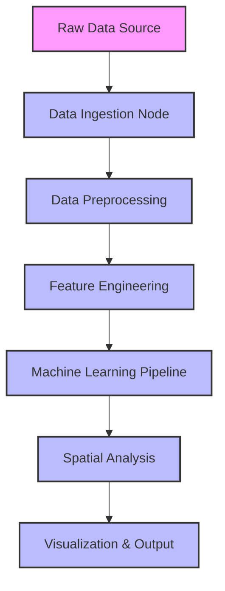

# System Architecture

This document outlines the high-level architecture and system components of the Crime Hotspot Detection project.

## Overall System Architecture

The system is built entirely within the **KNIME Analytics Platform**, creating a seamless flow from raw data to visual prediction models.



## Data Pipeline Architecture

The data pipeline handles the transformation of 276,529 crime records (2012-2017) into a format suitable for spatial machine learning.

```mermaid
flowchart LR
    A[(Baltimore Crime Dataset)] --> B[Read CSV]
    B --> C{Missing Values Filter}
    C -->|Keep Valid| D[Extract Timestamp Components]
    C -->|Drop| E[Discarded]
    D --> F[Coordinate Standardization (EPSG:4326)]
    F --> G[Data Aggregation by Region/Grid]
    G --> H[(Processed Dataset)]
```

## Machine Learning Architecture

The modeling phase utilizes a Random Forest Classifier to predict the likelihood of an area becoming a hotspot.

```mermaid
graph TD
    A[Processed Dataset] --> B[Train/Test Split (80/20)]
    B --> C[Random Forest Learner]
    C --> D{Model Evaluation}
    D -->|Scorer Node| E[Accuracy, Precision, Recall, F1]
    D -->|ROC Node| F[ROC Curve]
    B --> G[Random Forest Predictor]
    C --> G
    G --> H[Predicted Probabilities]
```

## Component Details

1.  **Data Ingestion:** Reads the massive dataset into KNIME memory efficiently.
2.  **Preprocessing:** Cleanses the data, focusing on repairing or discarding incomplete location data which is critical for spatial mapping.
3.  **Feature Engineering:** Converts raw coordinates into logical regions and defines hotspots using the 80th percentile frequency threshold.
4.  **Modeling:** The Random Forest model processes the categorical and numerical inputs to map out complex spatial relationships.
5.  **Visualization:** Generates KDE Heatmaps overlaying predictions on Baltimore's map.
